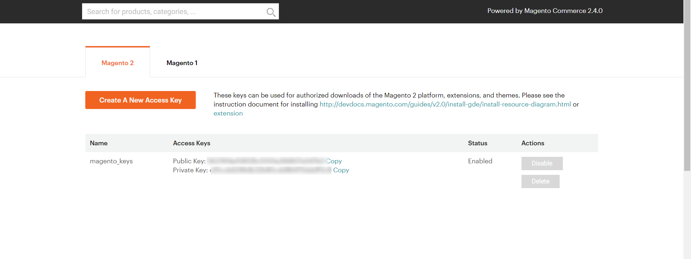
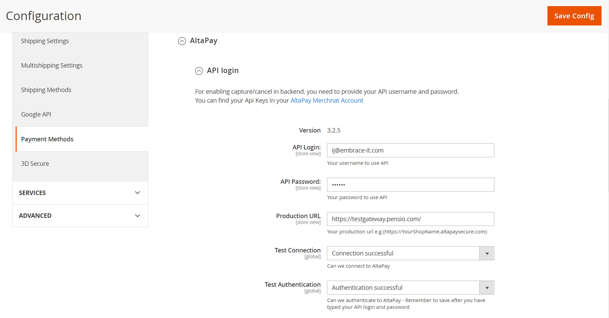
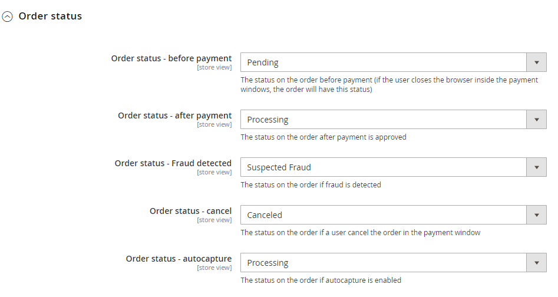
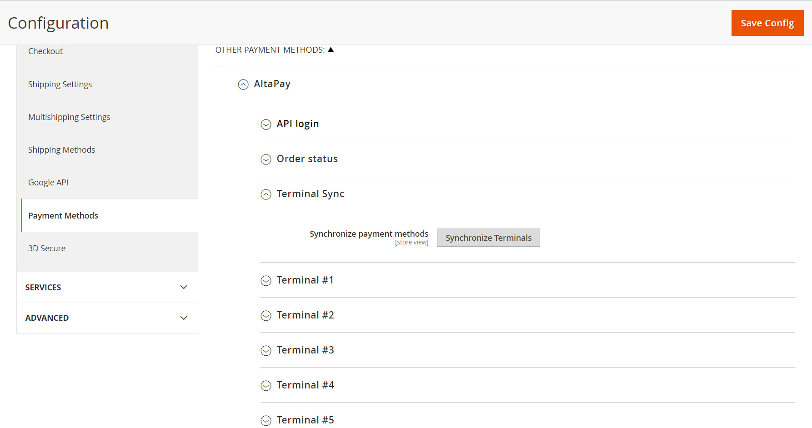

# AltaPay Magento 2 Plugin

AltaPay, headquartered in Denmark, is an internationally focused fintech company within payments with the mission to make payments less complicated. We help our merchants grow and expand their business across payment channels by offering a fully integrated seamless omni-channel experience for online, mobile and instore payments, creating transparency and reducing the need for manual tasks with one centralized payment platform.

AltaPay’s platform automizes, simplifies, and protects the transaction flow for shop owners and global retail and e-commerce companies, supporting and integrating smoothly into the major ERP systems. AltaPay performs as a Payment Service Provider operating under The Payment Card Industry Data Security Standard (PCI DSS).

# Magento2 Payment plugin installation guide


Installing this plugin will enable your website to handle card transactions through AltaPay's gateway.

We highly recommend gathering all the below information, before starting the installation.


**Table of Contents**

[Prerequisites](#prerequisites)

[Installation](#installation)

[Configuration](#configuration)

[Configure order status](#configure-order-status)

[Configure terminals](#configure-terminals)

[Supported versions](#supported-versions)

[Styling](#styling)

[Troubleshooting](#troubleshooting)

# Prerequisites

Before configuring the plugin, you need the below information. These can
be provided by AltaPay.

1.  AltaPay credentials:

-   Username

-   Password

2.  AltaPay gateway information:

-   Terminal

-   Gateway

3.  The package manager Composer (https://getcomposer.org/) must be
    installed on the server side.

4.  Your private and public keys must be located at 'repo.magento.com'
    when installing the AltaPay module.

# Installation

## Install from zip file

-   Search for "AltaPay Payment Gateway"

-   Download extension from Marketplace and place inside your project

     `root/app/code`

-   In Magento root directory run the following commands using the command line

     `php bin/magento setup:upgrade`

     `php bin/magento setup:static-content:deploy`

## Install via composer (Recommended)

-   In Magento root directory run the following commands using the
    command line

     `composer requires altapay/magento2-community`  

     `php bin/magento setup:upgrade` 

     `php bin/magento setup:di:compile` 

     `php bin/magento setup:static-content:deploy`
>
> _Note: If asked for authentication, use your Public Key as the
> username, and the Private Key as the password. This information can be
> found in the Secure Keys section of your Magento account:_



## Additional Steps

-   Check that the module is enabled  
    `php bin/magento module:status`

**SDM_Altapay** will appear in the module list, if not enabled run below
command

-   Enable the AltaPay module  
    `php bin/magento module:enable SDM_Altapay`

# Configuration

You can configure the plugin to suit your needs, including adding
payment methods and configuring payments.

1.  Connect the plugin to the AltaPay gateway

2.  Navigate to: Admin \> Stores \> Configuration \> Sales \> Payment Methods

3.  Complete the 'API Login', 'API Password' and 'Production URL' fields with the gateway information for your environment (provided by AltaPay)



4.  Click: 'Save Config' button

> If everything is correct, you should see the messages 'Connection
> successful' and 'Authentication successful' in the 'Test connection'
> and 'Test authentication' fields.
>
> Once the API details are validated the terminals will be appeared in
> the terminal's dropdown in each terminal.
## Configure order status

Navigate to: Admin \> Stores \> Configuration \> Sales (Tab) \> Payment
Methods



## Synchronize terminal

To synchronize the terminals with the gateway, click on the **Synchronize Terminals** button. This will fetch the latest terminals from the gateway and will automatically configure based on the store country.



## Configure terminals

1.  Navigate to: Admin \> Stores \> Configuration \> Sales (Tab) \>
    Payment Methods

2.  Enable the terminal

3.  Choose a title for the terminal

4.  Select the terminal name in the drop-down list

5.  Optional fields: 'Force language', 'Fraud detection', 'Auto
    capture', 'Terminal Logo', 'Enable Customer Token Control', 'AVS','
    AVS accepted codes'.

6.  Save changes by clicking 'Save Config'


# Supported versions

| 7.4.0         | Magento 2.4 |
|---------------|-------------|
| **7.1.3+, 7.2.x** | **Magento 2.3** |

_For Magneto 2.2 and below version please install the extension from
here._  
<https://packagist.org/packages/altapay/magento2-payment>

# Styling

- You can change/update the **Payment Form Page** by navigating to the below path:

    <https://github.com/AltaPay/plugin-magento2-community/blob/main/view/frontend/templates/ordersummary.phtml>

- Use the below link to apply the css to the form page:

    <https://github.com/AltaPay/plugin-magento2-community/blob/main/view/frontend/web/css/ordersummary.css>

>Note: It is recommended to extend the layout file instead of making changes in the plugin file directly. If you want to extend the layout file, use the below path in your custom module/theme:
>
><https://github.com/AltaPay/plugin-magento2-community/blob/main/view/frontend/layout/sdmaltapay_index_callbackform.xml>
>
>Please visit Magento's official documentation to know more about how to [Override a layout](https://devdocs.magento.com/guides/v2.4/frontend-dev-guide/layouts/layout-override.html).

# Troubleshooting

**PHP Warning: Input variables exceeded 1000. To increase the limit change max_input_vars in php.ini.**

For orders that contain too many products, this PHP warning may be issued. You will need to:

- Open your php.ini file
- Edit the max_input_vars variable. This specifies the maximum number of variables that can be sent in a request. The default is 1000. Increase it to, say, 3000.
- Restart your server.

**Parameters: description/unitPrice/quantity are required for each orderline, but was not set for line: xxxx**
> The same problem as above. The request is being truncated because the number of variables are exceeding the max_input_vars limit.


## Providing error logs to support team

You can find the logs from the below path:

**Debug logs:** ```<install_directory>/var/log/debug.log```
    
**Exception logs:** ```<install_directory>/var/log/exception.log```

**AltaPay plugin logs:** ```<install_directory>/var/log/altapay.log```

**Web server error logs**

**For Apache server** You can find it on **/var/log/apache2/error.log**

**For Nginx** it would be **/var/log/nginx/error.log**

**_Note: Your path may vary from the mentioned above._**
